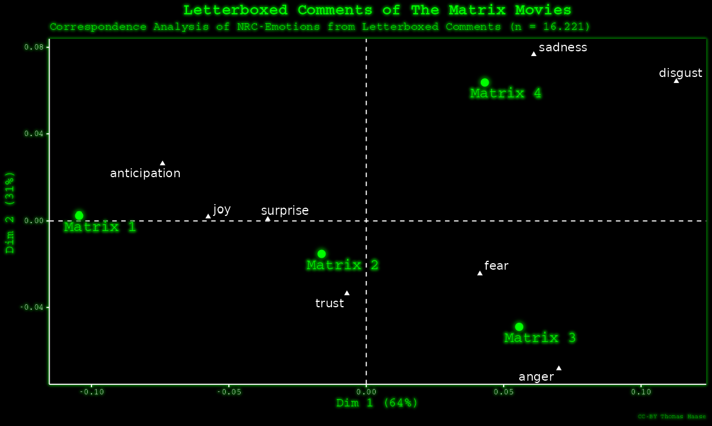
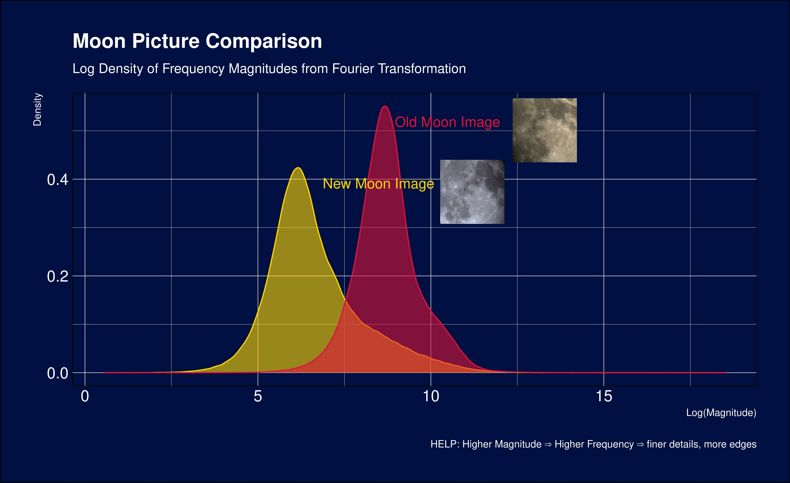

# 30DayChartChallenge_2024

<b> 👉️ Tasks: </b>

### Day 1: Comparison - Part of a whole

### Day 2: Comparison - Neo

### Day 3: Comparison - Makeover

<b>❓️Why are higher frequencies related to finer details? </b>

- Higher frequencies in Fourier analysis represent rapid changes in intensity over a short distance in the image. 
	- Example: a picture of a starry night: the stars against the dark sky change from bright to dark very quickly as you move across the image – that's a high-frequency change.

- High-frequencies --> sharp transitions or variations in an image (edges/textures). 
- Low-frequencies --> smooth, slowly varying area.

When you see high frequencies being prominent in the Fourier transform of an image, it's a sign that the image has many of these rapid changes in intensity – lots of fine details.

Overlapping parts of the densities --> same frequencies are being communicated through the image --> the similar parts of the images

### Day 4: Comparison - Waffle

### Day 5: Comparison - Diverging

